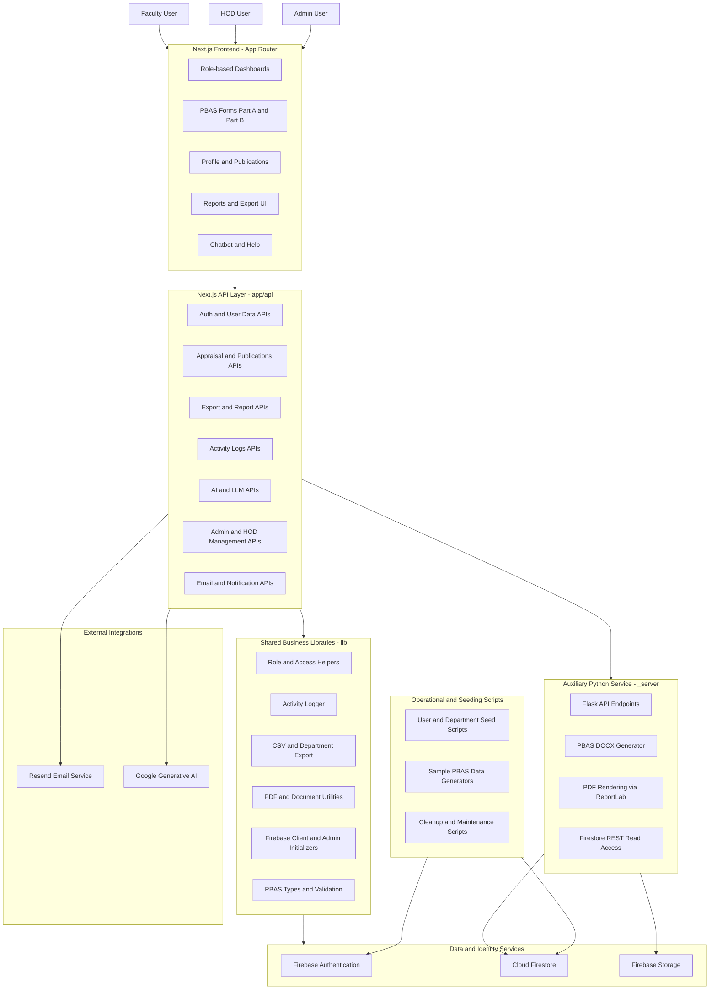

# Shikshak Saarthi - System Block Diagram

## 1. Purpose

This document describes the full system architecture of Shikshak Saarthi as a block diagram, including:

- User-facing applications
- Core application services
- Data and identity services
- External integrations
- Auxiliary Python document-generation service

## 2. High-Level Block Diagram

## 3. Block Responsibilities

### A. User and Presentation Layer

- Provides role-specific interfaces for Faculty, HOD, and Admin.
- Handles form input, review workflows, dashboard rendering, and report actions.
- Routes requests to server endpoints for protected operations.

### B. API and Application Layer

- Implements route handlers under app/api for modular domain operations.
- Enforces authentication and role-aware authorization before data mutation.
- Coordinates cross-service workflows such as export, notifications, and AI assistance.

### C. Core Shared Library Layer

- Centralizes shared logic used by pages and APIs.
- Maintains consistent behavior for logging, export formatting, PDF generation, and type safety.
- Encapsulates Firebase initialization logic for client and server contexts.

### D. Data and Identity Layer

- Firebase Authentication controls sign-up, sign-in, and password reset journeys.
- Firestore stores user profiles, PBAS forms, activity logs, publications, and analytics inputs.
- Firebase Storage supports document and file persistence where needed.

### E. External Service Layer

- Resend delivers onboarding, password reset, and notification emails.
- Google Generative AI powers chatbot and form-assistance capabilities.

### F. Auxiliary Python Service

- Exposes Flask endpoints for PBAS document generation and health checks.
- Generates DOCX outputs from PBAS payloads.
- Generates branded PDF reports when PDF dependencies are available.
- Reads Firestore data through REST-based integration for selected flows.

### G. Operations Layer

- Scripted setup and maintenance tasks for users, sample datasets, and environment preparation.
- Supports repeatable development and testing workflows.

## 4. Primary End-to-End Flows

### Flow 1: Authentication and Profile Access

1. User signs in from frontend auth pages.
2. Firebase Authentication verifies identity and session.
3. API and frontend fetch profile and role metadata from Firestore.
4. User is routed to the correct dashboard by role.

### Flow 2: PBAS Submission and Tracking

1. Faculty fills PBAS forms in frontend modules.
2. API handlers validate payloads and persist records to Firestore.
3. Activity logger records auditable events.
4. HOD and Admin dashboards consume aggregated data for review.

### Flow 3: Export and Report Generation

1. User requests CSV or report export from UI.
2. API layer invokes export utilities in shared libraries.
3. Data is collected from Firestore and transformed to output format.
4. Result is downloaded or handed off to downstream generation services.

### Flow 4: Document Generation via Python Service

1. Next.js API or client action calls Flask document endpoint.
2. Python service maps PBAS data to template structures.
3. DOCX and optional PDF are generated.
4. Generated file is returned to caller for download or storage.

### Flow 5: AI-Assisted Form Help

1. User asks question in chatbot or AI-enabled form step.
2. Next.js AI route sends context to Google Generative AI.
3. Response is returned to frontend with guidance text.

## 5. Deployment View (Logical)

- Web Application Runtime: Next.js app serving pages and API endpoints.
- Managed Cloud Services: Firebase Authentication, Firestore, and Storage.
- Integration Services: Resend and Google Generative AI.
- Auxiliary Compute: Flask service for advanced PBAS document generation.

## 6. Directory-to-Block Mapping

- app -> Frontend pages and API handlers
- components -> Reusable UI blocks and form components
- lib -> Shared business logic, utilities, and service wrappers
- hooks -> Reusable React hooks
- scripts -> Seeding and maintenance operations
- _server -> Python Flask document generation service
- public -> Static assets and PWA metadata

## 7. Notes

- The diagram is logical, not network-topology specific.
- Authorization behavior is role-driven across Faculty, HOD, and Admin paths.
- The Python service is optional for flows that require advanced DOCX or PDF generation.